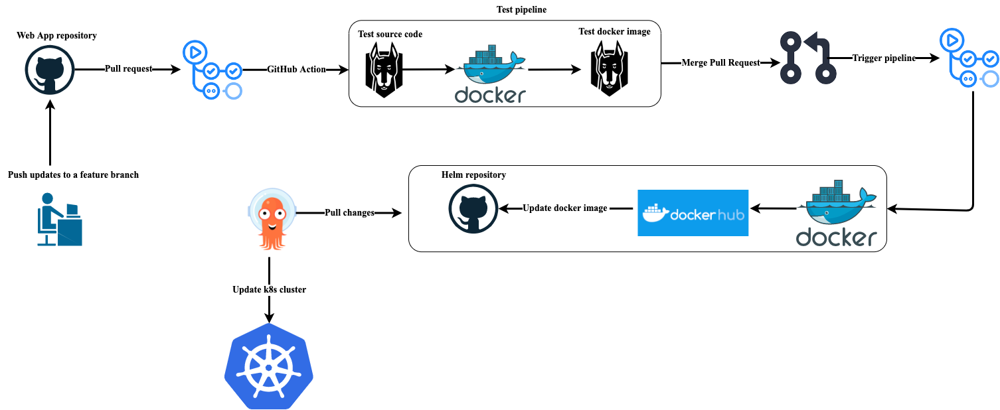

# Weather_app_project_eks

## Pipeline Architecture Overview

## Description
This project implements a robust CI/CD pipeline for a simple Weather application. Leveraging the power of GitHub Actions and Snyk, the pipeline is divided into two stages, providing seamless integration and deployment processes. It is valuable to mention that this Github Repository takes part as one of three repositories that are being utilized for this project.

### Terraform Repository
The Terraform repository contains required infrastructure to create the EKS cluster that will host the weather application. 
To view the repository please view this link: https://github.com/OfekMalul/terraform_eks 

### Helm Repository
The Helm repository is utilize as gitops for ArgoCD. ArgoCD is deployed in the EKS cluster and continously follow on changes taken place to the weather_app helm chart. If changes occured ArgoCD will manage the deployment of it. 
To view the repository please view this link: https://github.com/OfekMalul/helm_charts/tree/main/CreatedByMe/weather_app_chart

## Pipelines Overview
### 1. Pull Request Pipeline:
Triggered upon the creation of a pull request, this pipeline employs Snyk to conduct comprehensive testing of both the project source code and Docker image. This ensures that potential vulnerabilities are identified and addressed before merging changes into the main branch.

### 2. Merge Pipeline:
Triggered upon the successful merge of a pull request, this pipeline orchestrates the deployment process. It pushes the Docker image to Docker Hub, ensuring its availability for deployment. Also, the pipeline updates the Helm repository with the new Docker image tag (https://github.com/OfekMalul/helm_charts/tree/main/CreatedByMe/weather_app_chart). This guarantees that the latest changes are seamlessly integrated into the deployment environment. The deployment of the helm chart is being taken care of by ArgoCD.

## Requirements
1. Github Account
2. Snyk Account
3. DockerHub Account
4. AWS Account
5. Working EKS Cluster
6. Deployed ArgoCD
7. Helm Repository for Gitops

*** Please note that points 4 - 7 are not directly related to this repository but are essential for the overall functioning of the three repositories project. ***

## Setup Instructions

### Github Account
This readme file is created with the understanding that the reader is familer with Github.

1. Create Find-graind token that will enable the github runner to access and modify your current repository and your Helm repository
    - Click on your profile
    - Click settings
    - Click on Developer settings (find at bottom left of navbar)
    - Click on Personal access tokens --> Fine-graind tokens
    - Select repositories --> choose your helm repository + app repository
    - Enable follow repository permissions
        i. Actions - read and write
        ii. Contents - read and write
        iii. Metadata - read
        iv. Workflows - read and write
    - Copy token

2. Paste to Github Secrets
    - Go to your selected repository
    - Click on settings
    - Click on Secrets and Variables
    - Click on Actions at the drop down menu
    - Click on new repository secret
    - Secret name = TOKEN_GITHUB value = <fine_graind_token>

3. Update your github repository settings to enable read and write
    - Go to your helm repository
    - Click settings
    - Click Actions
    - Click General
    - Workflow permissions --> Read and Write permissions

### Snyk Integrate with Github Actions
1. Create Snyk Account follow this link: 
https://www.snyk.io

2. Copy Snyk token to GitHub secrets
    - Click on your profile on the bottom left corner
    - Click on account settings
    - Copy Auth Token

3. Paste to Github Secrets
    - Secret name = SNYK_TOKEN value = <Snyk_Token>

### Create DockerHub Account
To create a DockerHub account follow this link: 
https://hub.docker.com/signup

1. Create public DockerHub repository to store your docker images

2. Update github actions ci.yaml to follow your personal DokckerHub repository.
    - Add your DockerHub username and passwrod to Github secrets
        1. DOCKER_USER = <YOUR_USERNAME>
        2. DOCKER_PASSWORD = <YOUR_PASSWORD>
    - Update Helm repository to match your helm repository
    - Update the sed command to personally fit to the location of your values.yaml file